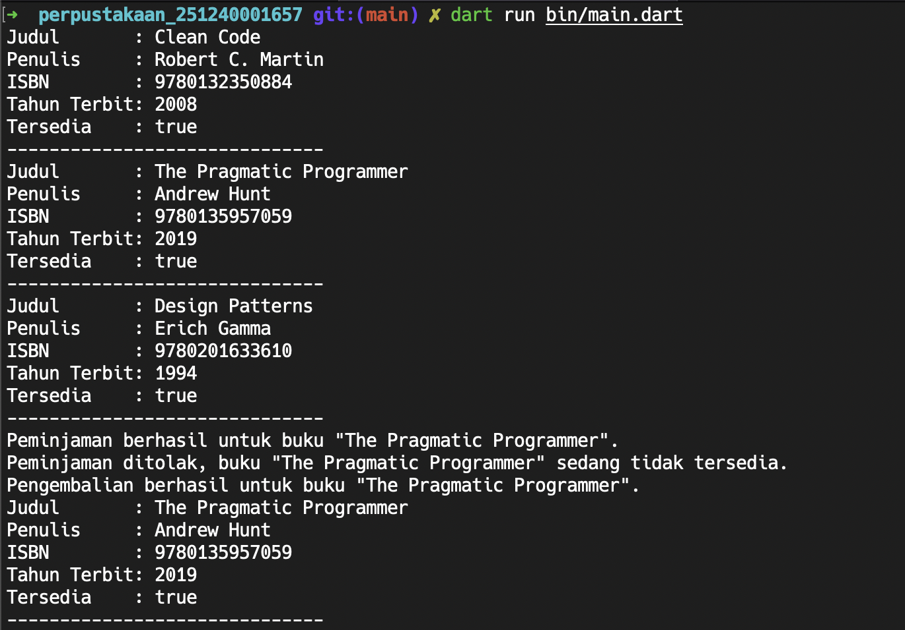

# Sistem Perpustakaan

[](https://github.com/decryptable/sistem_perpustakaan/actions/workflows/ci.yml)

## Screenshot



## Jalankan Program

```bash
dart run bin/main.dart

Judul       : Clean Code
Penulis     : Robert C. Martin
ISBN        : 9780132350884
Tahun Terbit: 2008
Tersedia    : true
------------------------------
Judul       : The Pragmatic Programmer
Penulis     : Andrew Hunt
ISBN        : 9780135957059
Tahun Terbit: 2019
Tersedia    : true
------------------------------
Judul       : Design Patterns
Penulis     : Erich Gamma
ISBN        : 9780201633610
Tahun Terbit: 1994
Tersedia    : true
------------------------------
Peminjaman berhasil untuk buku "The Pragmatic Programmer".
Peminjaman ditolak, buku "The Pragmatic Programmer" sedang tidak tersedia.
Pengembalian berhasil untuk buku "The Pragmatic Programmer".
Judul       : The Pragmatic Programmer
Penulis     : Andrew Hunt
ISBN        : 9780135957059
Tahun Terbit: 2019
Tersedia    : true
------------------------------
```

## Compile Native Executable

```bash
dart compile exe bin/main.dart -o build/sistem_perpustakaan
```

## Struktur Direktori

```text
sistem_perpustakaan/
├── .github/
│   └── workflows/
│       └── ci.yml
├── lib/
│   ├── models/
│   │   └── buku.dart
│   ├── services/
│   │   └── perpustakaan_service.dart
│   └── app.dart
├── bin/
│   └── main.dart
├── pubspec.yaml
├── analysis_options.yaml
└── README.md
```
